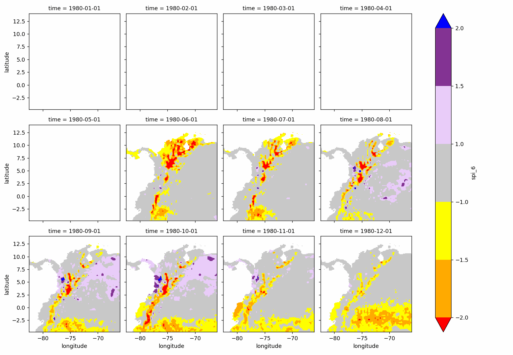
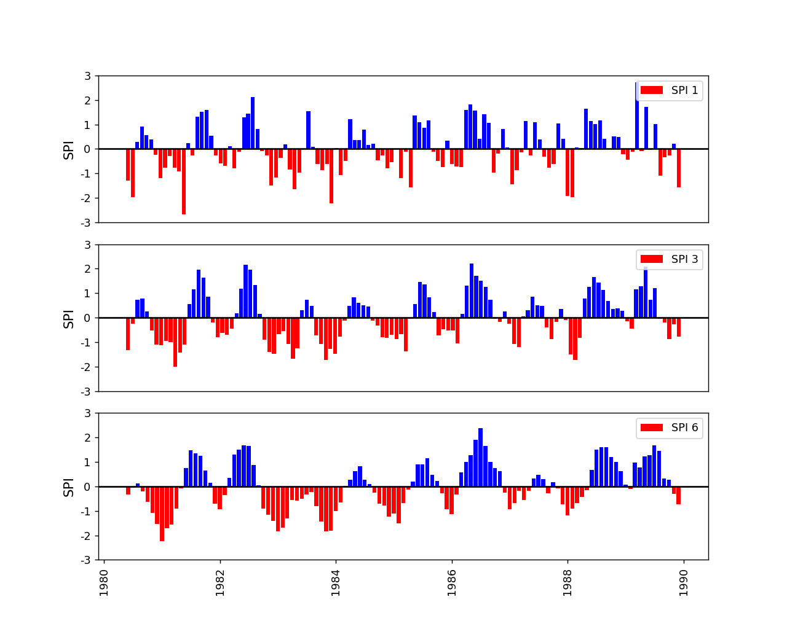

# Colombia - South America - Atmospheric water balance (AWB) and Drought analysis with the Standardized Precipitation Index (SPI)
Keywords: `SWB` `AWB` `SPI` `ERA5` `CRU`

The current research.....

## General parameters  

<div align="center">

| Parameter | Description |
|:---|:---|
| PPOI | 1 |
| Client | r.cfdtools Researching Area |
| Order | rcfdtools-000000001 |
| Date | 2023-05-30 |
| Dataset | [ERA5Land_Monthly_01dd_ds1.nc](../../.netcdf/) |
| Units conversion multiplier | 1000.000000 |
| Precipitation maximum plot value | 20.000000 |
| Year from | 1980 |
| Year to | 1989 |

</div>

> The maximum plot value of precipitation is used to truncate the palette colors in the geographic map representations, pixels or cells over these values are displayed in a single color.

## Standardized Precipitation Index (SPI)

The Standardized Precipitation Index (SPI) is a widely used index to characterize meteorological drought on a range of timescales. On short timescales, the SPI is closely related to soil moisture, while at longer timescales, the SPI can be related to groundwater and reservoir storage. The SPI can be compared across regions with markedly different climates. It quantifies observed precipitation as a standardized departure from a selected probability distribution function that models the raw precipitation data. The raw precipitation data are typically fitted to a gamma or a Pearson Type III distribution, and then transformed to a normal distribution. The SPI values can be interpreted as the number of standard deviations by which the observed anomaly deviates from the long-term mean. The SPI can be created for differing periods of 1-to-36 months, using monthly input data. For the operational community, the SPI has been recognized as the standard index that should be available worldwide for quantifying and reporting meteorological drought. Concerns have been raised about the utility of the SPI as a measure of changes in drought associated with climate change, as it does not deal with changes in evapotranspiration. [(NCAR)](https://climatedataguide.ucar.edu/climate-data/standardized-precipitation-index-spi)

Precipitation: accumulated liquid and frozen water, including rain and snow, that falls to the Earths surface. It is the sum of large-scale precipitation (that precipitation which is generated by large-scale weather patterns, such as troughs and cold fronts) and convective precipitation (generated by convection which occurs when air at lower levels in the atmosphere is warmer and less dense than the air above, so it rises). Precipitation variables do not include fog, dew or the precipitation that evaporates in the atmosphere before it lands at the surface of the Earth. This variable is accumulated from the beginning of the forecast time to the end of the forecast step. The units of precipitation are depth in metres. It is the depth the water would have if it were spread evenly over the grid box. Care should be taken when comparing model variables with observations, because observations are often local to a particular point in space and time, rather than representing averages over a model grid box and model time step. [(www.copernicus.eu)](https://cds.climate.copernicus.eu/cdsapp#!/dataset/reanalysis-era5-land-monthly-means)

* SPI index mobile average times: [1, 3, 6]

### Zonal analysis over N: 5.735000°, S: 3.625000°, E: -72.875000°, W: -74.875000°

#### NetCDF initial dataset

```
<xarray.Dataset>
Dimensions:    (longitude: 711, latitude: 741, time: 468)
Coordinates:
  * longitude  (longitude) float32 -96.0 -95.9 -95.8 -95.7 ... -25.2 -25.1 -25.0
  * latitude   (latitude) float32 16.0 15.9 15.8 15.7 ... -57.8 -57.9 -58.0
  * time       (time) datetime64[ns] 1980-01-01 1980-02-01 ... 2022-12-01
Data variables:
    u10        (time, latitude, longitude) float32 ...
    v10        (time, latitude, longitude) float32 ...
    t2m        (time, latitude, longitude) float32 ...
    e          (time, latitude, longitude) float32 ...
    tp         (time, latitude, longitude) float32 0.949 0.7166 ... nan nan
Attributes:
    Conventions:  CF-1.6
    history:      2023-05-15 19:06:50 GMT by grib_to_netcdf-2.24.0: /opt/ecmw...
```

#### Individual plots

[`P-1980`](spi/era5/era5_p_1980.png) [`SPI-1-1980`](spi/era5/era5_spi_1_1980.png) [`P-1981`](spi/era5/era5_p_1981.png) [`SPI-1-1981`](spi/era5/era5_spi_1_1981.png) [`P-1982`](spi/era5/era5_p_1982.png) [`SPI-1-1982`](spi/era5/era5_spi_1_1982.png) [`P-1983`](spi/era5/era5_p_1983.png) [`SPI-1-1983`](spi/era5/era5_spi_1_1983.png) [`P-1984`](spi/era5/era5_p_1984.png) [`SPI-1-1984`](spi/era5/era5_spi_1_1984.png) [`P-1985`](spi/era5/era5_p_1985.png) [`SPI-1-1985`](spi/era5/era5_spi_1_1985.png) [`P-1986`](spi/era5/era5_p_1986.png) [`SPI-1-1986`](spi/era5/era5_spi_1_1986.png) [`P-1987`](spi/era5/era5_p_1987.png) [`SPI-1-1987`](spi/era5/era5_spi_1_1987.png) [`P-1988`](spi/era5/era5_p_1988.png) [`SPI-1-1988`](spi/era5/era5_spi_1_1988.png) [`P-1989`](spi/era5/era5_p_1989.png) [`SPI-1-1989`](spi/era5/era5_spi_1_1989.png) [`SPI-3-1980`](spi/era5/era5_spi_3_1980.png) [`SPI-3-1981`](spi/era5/era5_spi_3_1981.png) [`SPI-3-1982`](spi/era5/era5_spi_3_1982.png) [`SPI-3-1983`](spi/era5/era5_spi_3_1983.png) [`SPI-3-1984`](spi/era5/era5_spi_3_1984.png) [`SPI-3-1985`](spi/era5/era5_spi_3_1985.png) [`SPI-3-1986`](spi/era5/era5_spi_3_1986.png) [`SPI-3-1987`](spi/era5/era5_spi_3_1987.png) [`SPI-3-1988`](spi/era5/era5_spi_3_1988.png) [`SPI-3-1989`](spi/era5/era5_spi_3_1989.png) [`SPI-6-1980`](spi/era5/era5_spi_6_1980.png) [`SPI-6-1981`](spi/era5/era5_spi_6_1981.png) [`SPI-6-1982`](spi/era5/era5_spi_6_1982.png) [`SPI-6-1983`](spi/era5/era5_spi_6_1983.png) [`SPI-6-1984`](spi/era5/era5_spi_6_1984.png) [`SPI-6-1985`](spi/era5/era5_spi_6_1985.png) [`SPI-6-1986`](spi/era5/era5_spi_6_1986.png) [`SPI-6-1987`](spi/era5/era5_spi_6_1987.png) [`SPI-6-1988`](spi/era5/era5_spi_6_1988.png) [`SPI-6-1989`](spi/era5/era5_spi_6_1989.png) 

#### Output sliced datasets

* Dataset as comma-separated values: [era5_spi_polygon.csv](spi/)
* Dataset as NetCDF: [era5_spi_polygon.nc](spi/)

```
<xarray.Dataset>
Dimensions:    (longitude: 20, latitude: 21, time: 120)
Coordinates:
  * longitude  (longitude) float32 -74.8 -74.7 -74.6 -74.5 ... -73.1 -73.0 -72.9
  * latitude   (latitude) float32 5.7 5.6 5.5 5.4 5.3 ... 4.1 4.0 3.9 3.8 3.7
  * time       (time) datetime64[ns] 1980-01-01 1980-02-01 ... 1989-12-01
Data variables:
    u10        (time, latitude, longitude) float32 0.9342 0.6416 ... -1.729
    v10        (time, latitude, longitude) float32 -0.1936 0.06651 ... -2.654
    t2m        (time, latitude, longitude) float32 298.7 299.6 ... 299.1 299.3
    e          (time, latitude, longitude) float32 -0.003726 ... -0.004156
    tp         (time, latitude, longitude) float32 2.395 2.049 ... 0.8788 0.8085
    spi_1      (time, latitude, longitude) float64 -0.8376 -0.985 ... -2.012
    spi_3      (time, latitude, longitude) float64 nan nan ... -0.0715 0.004413
    spi_6      (time, latitude, longitude) float64 nan nan ... -0.02175 0.06038
Attributes:
    Conventions:  CF-1.6
    history:      2023-05-15 19:06:50 GMT by grib_to_netcdf-2.24.0: /opt/ecmw...
```

#### Animations

Precipitation


SPI-1


SPI-3


SPI-6


Records processed: 56880000

### Point analysis in Latitude: 4.600000°, Longitude: -73.700000° or nearest


Dataset as comma-separated values: [era5_point.csv](spi/)
<div align="center">

|           |   1980-01-01 00:00:00 |   1980-02-01 00:00:00 |   1980-03-01 00:00:00 |   1980-04-01 00:00:00 |   1980-05-01 00:00:00 |   1980-06-01 00:00:00 |   1980-07-01 00:00:00 |   1980-08-01 00:00:00 |   1980-09-01 00:00:00 |   1980-10-01 00:00:00 |   1980-11-01 00:00:00 |   1980-12-01 00:00:00 |   1981-01-01 00:00:00 |   1981-02-01 00:00:00 |   1981-03-01 00:00:00 |   1981-04-01 00:00:00 |   1981-05-01 00:00:00 |   1981-06-01 00:00:00 |   1981-07-01 00:00:00 |   1981-08-01 00:00:00 |   1981-09-01 00:00:00 |   1981-10-01 00:00:00 |   1981-11-01 00:00:00 |   1981-12-01 00:00:00 |   1982-01-01 00:00:00 |   1982-02-01 00:00:00 |   1982-03-01 00:00:00 |   1982-04-01 00:00:00 |   1982-05-01 00:00:00 |   1982-06-01 00:00:00 |   1982-07-01 00:00:00 |   1982-08-01 00:00:00 |   1982-09-01 00:00:00 |   1982-10-01 00:00:00 |   1982-11-01 00:00:00 |   1982-12-01 00:00:00 |   1983-01-01 00:00:00 |   1983-02-01 00:00:00 |   1983-03-01 00:00:00 |   1983-04-01 00:00:00 |   1983-05-01 00:00:00 |   1983-06-01 00:00:00 |   1983-07-01 00:00:00 |   1983-08-01 00:00:00 |   1983-09-01 00:00:00 |   1983-10-01 00:00:00 |   1983-11-01 00:00:00 |   1983-12-01 00:00:00 |   1984-01-01 00:00:00 |   1984-02-01 00:00:00 |   1984-03-01 00:00:00 |   1984-04-01 00:00:00 |   1984-05-01 00:00:00 |   1984-06-01 00:00:00 |   1984-07-01 00:00:00 |   1984-08-01 00:00:00 |   1984-09-01 00:00:00 |   1984-10-01 00:00:00 |   1984-11-01 00:00:00 |   1984-12-01 00:00:00 |   1985-01-01 00:00:00 |   1985-02-01 00:00:00 |   1985-03-01 00:00:00 |   1985-04-01 00:00:00 |   1985-05-01 00:00:00 |   1985-06-01 00:00:00 |   1985-07-01 00:00:00 |   1985-08-01 00:00:00 |   1985-09-01 00:00:00 |   1985-10-01 00:00:00 |   1985-11-01 00:00:00 |   1985-12-01 00:00:00 |   1986-01-01 00:00:00 |   1986-02-01 00:00:00 |   1986-03-01 00:00:00 |   1986-04-01 00:00:00 |   1986-05-01 00:00:00 |   1986-06-01 00:00:00 |   1986-07-01 00:00:00 |   1986-08-01 00:00:00 |   1986-09-01 00:00:00 |   1986-10-01 00:00:00 |   1986-11-01 00:00:00 |   1986-12-01 00:00:00 |   1987-01-01 00:00:00 |   1987-02-01 00:00:00 |   1987-03-01 00:00:00 |   1987-04-01 00:00:00 |   1987-05-01 00:00:00 |   1987-06-01 00:00:00 |   1987-07-01 00:00:00 |   1987-08-01 00:00:00 |   1987-09-01 00:00:00 |   1987-10-01 00:00:00 |   1987-11-01 00:00:00 |   1987-12-01 00:00:00 |   1988-01-01 00:00:00 |   1988-02-01 00:00:00 |   1988-03-01 00:00:00 |   1988-04-01 00:00:00 |   1988-05-01 00:00:00 |   1988-06-01 00:00:00 |   1988-07-01 00:00:00 |   1988-08-01 00:00:00 |   1988-09-01 00:00:00 |   1988-10-01 00:00:00 |   1988-11-01 00:00:00 |   1988-12-01 00:00:00 |   1989-01-01 00:00:00 |   1989-02-01 00:00:00 |   1989-03-01 00:00:00 |   1989-04-01 00:00:00 |   1989-05-01 00:00:00 |   1989-06-01 00:00:00 |   1989-07-01 00:00:00 |   1989-08-01 00:00:00 |   1989-09-01 00:00:00 |   1989-10-01 00:00:00 |   1989-11-01 00:00:00 |   1989-12-01 00:00:00 |
|:----------|----------------------:|----------------------:|----------------------:|----------------------:|----------------------:|----------------------:|----------------------:|----------------------:|----------------------:|----------------------:|----------------------:|----------------------:|----------------------:|----------------------:|----------------------:|----------------------:|----------------------:|----------------------:|----------------------:|----------------------:|----------------------:|----------------------:|----------------------:|----------------------:|----------------------:|----------------------:|----------------------:|----------------------:|----------------------:|----------------------:|----------------------:|----------------------:|----------------------:|----------------------:|----------------------:|----------------------:|----------------------:|----------------------:|----------------------:|----------------------:|----------------------:|----------------------:|----------------------:|----------------------:|----------------------:|----------------------:|----------------------:|----------------------:|----------------------:|----------------------:|----------------------:|----------------------:|----------------------:|----------------------:|----------------------:|----------------------:|----------------------:|----------------------:|----------------------:|----------------------:|----------------------:|----------------------:|----------------------:|----------------------:|----------------------:|----------------------:|----------------------:|----------------------:|----------------------:|----------------------:|----------------------:|----------------------:|----------------------:|----------------------:|----------------------:|----------------------:|----------------------:|----------------------:|----------------------:|----------------------:|----------------------:|----------------------:|----------------------:|----------------------:|----------------------:|----------------------:|----------------------:|----------------------:|----------------------:|----------------------:|----------------------:|----------------------:|----------------------:|----------------------:|----------------------:|----------------------:|----------------------:|----------------------:|----------------------:|----------------------:|----------------------:|----------------------:|----------------------:|----------------------:|----------------------:|----------------------:|----------------------:|----------------------:|----------------------:|----------------------:|----------------------:|----------------------:|----------------------:|----------------------:|----------------------:|----------------------:|----------------------:|----------------------:|----------------------:|----------------------:|
| longitude |             -73.7     |             -73.7     |             -73.7     |              -73.7    |              -73.7    |             -73.7     |             -73.7     |             -73.7     |             -73.7     |             -73.7     |             -73.7     |             -73.7     |             -73.7     |             -73.7     |             -73.7     |              -73.7    |              -73.7    |              -73.7    |              -73.7    |             -73.7     |             -73.7     |             -73.7     |             -73.7     |             -73.7     |             -73.7     |              -73.7    |              -73.7    |              -73.7    |              -73.7    |             -73.7     |             -73.7     |              -73.7    |             -73.7     |               -73.7   |             -73.7     |             -73.7     |             -73.7     |             -73.7     |             -73.7     |              -73.7    |             -73.7     |             -73.7     |             -73.7     |             -73.7     |             -73.7     |             -73.7     |             -73.7     |             -73.7     |              -73.7    |             -73.7     |             -73.7     |              -73.7    |             -73.7     |             -73.7     |             -73.7     |             -73.7     |             -73.7     |             -73.7     |             -73.7     |             -73.7     |             -73.7     |             -73.7     |              -73.7    |              -73.7    |              -73.7    |              -73.7    |             -73.7     |             -73.7     |             -73.7     |               -73.7   |             -73.7     |             -73.7     |             -73.7     |              -73.7    |              -73.7    |              -73.7    |             -73.7     |              -73.7    |              -73.7    |             -73.7     |             -73.7     |              -73.7    |              -73.7    |             -73.7     |             -73.7     |             -73.7     |              -73.7    |             -73.7     |              -73.7    |             -73.7     |             -73.7     |             -73.7     |             -73.7     |              -73.7    |             -73.7     |             -73.7     |             -73.7     |              -73.7    |             -73.7     |              -73.7    |              -73.7    |              -73.7    |              -73.7    |             -73.7     |              -73.7    |              -73.7    |               -73.7   |             -73.7     |             -73.7     |             -73.7     |              -73.7    |             -73.7     |              -73.7    |             -73.7     |               -73.7   |             -73.7     |             -73.7     |             -73.7     |             -73.7     |             -73.7     |
| latitude  |               4.6     |               4.6     |               4.6     |                4.6    |                4.6    |               4.6     |               4.6     |               4.6     |               4.6     |               4.6     |               4.6     |               4.6     |               4.6     |               4.6     |               4.6     |                4.6    |                4.6    |                4.6    |                4.6    |               4.6     |               4.6     |               4.6     |               4.6     |               4.6     |               4.6     |                4.6    |                4.6    |                4.6    |                4.6    |               4.6     |               4.6     |                4.6    |               4.6     |                 4.6   |               4.6     |               4.6     |               4.6     |               4.6     |               4.6     |                4.6    |               4.6     |               4.6     |               4.6     |               4.6     |               4.6     |               4.6     |               4.6     |               4.6     |                4.6    |               4.6     |               4.6     |                4.6    |               4.6     |               4.6     |               4.6     |               4.6     |               4.6     |               4.6     |               4.6     |               4.6     |               4.6     |               4.6     |                4.6    |                4.6    |                4.6    |                4.6    |               4.6     |               4.6     |               4.6     |                 4.6   |               4.6     |               4.6     |               4.6     |                4.6    |                4.6    |                4.6    |               4.6     |                4.6    |                4.6    |               4.6     |               4.6     |                4.6    |                4.6    |               4.6     |               4.6     |               4.6     |                4.6    |               4.6     |                4.6    |               4.6     |               4.6     |               4.6     |               4.6     |                4.6    |               4.6     |               4.6     |               4.6     |                4.6    |               4.6     |                4.6    |                4.6    |                4.6    |                4.6    |               4.6     |                4.6    |                4.6    |                 4.6   |               4.6     |               4.6     |               4.6     |                4.6    |               4.6     |                4.6    |               4.6     |                 4.6   |               4.6     |               4.6     |               4.6     |               4.6     |               4.6     |
| tp        |               5.77634 |               4.53302 |               9.47385 |               11.3496 |               10.2874 |               9.79279 |               8.11161 |               5.94932 |               6.86559 |               7.95484 |               6.84937 |               6.50881 |               3.44917 |               9.36574 |               8.02241 |               12.5984 |               13.3092 |               13.5849 |               10.1874 |               8.05485 |               7.27102 |               7.04398 |               9.01166 |               6.80072 |               8.39812 |               12.5632 |               13.0227 |               15.5012 |               11.0226 |               8.46839 |               8.05756 |                5.3655 |               5.98175 |                 7.817 |               9.24141 |               6.67639 |               5.09792 |               6.44935 |               8.66299 |               13.4281 |               8.93598 |               7.21966 |               6.62503 |               7.18182 |               4.13029 |               8.78462 |               6.23853 |               7.48184 |               12.2875 |               9.70089 |               9.67927 |               10.9307 |               9.14951 |               9.27655 |               7.57915 |               8.06566 |               6.79261 |               7.38183 |               8.65218 |               5.94661 |               8.40352 |               5.24117 |               12.8011 |               11.9091 |               11.1848 |               12.1037 |               8.39001 |               7.49806 |               6.91424 |                 9.609 |               7.22237 |               6.98181 |               6.94397 |               13.5984 |               14.3687 |               13.4552 |               9.83604 |               12.9443 |               11.7929 |               6.42773 |               8.21702 |               11.0496 |                8.8549 |               5.44929 |               6.63855 |               8.37109 |               12.0524 |               8.03323 |               11.8713 |               9.73603 |               7.89538 |               6.85478 |               7.18453 |               11.7416 |               9.84144 |               4.62492 |               4.54383 |                8.8603 |               8.81165 |               13.7606 |               12.0091 |               11.6334 |               12.1578 |               9.87387 |                8.7603 |               10.1117 |                10.082 |               8.17648 |               7.59536 |               8.41433 |               17.9014 |               8.46839 |               14.0579 |               8.60354 |                11.628 |               6.13852 |               7.83592 |               8.02512 |               9.26033 |               5.23847 |
</div>


Dataset with SPI calculations as comma-separated values: [era5_spi_point.csv](spi/)

<div align="center">

|           |   1980-01-01 00:00:00 |   1980-02-01 00:00:00 |   1980-03-01 00:00:00 |   1980-04-01 00:00:00 |   1980-05-01 00:00:00 |   1980-06-01 00:00:00 |   1980-07-01 00:00:00 |   1980-08-01 00:00:00 |   1980-09-01 00:00:00 |   1980-10-01 00:00:00 |   1980-11-01 00:00:00 |   1980-12-01 00:00:00 |   1981-01-01 00:00:00 |   1981-02-01 00:00:00 |   1981-03-01 00:00:00 |   1981-04-01 00:00:00 |   1981-05-01 00:00:00 |   1981-06-01 00:00:00 |   1981-07-01 00:00:00 |   1981-08-01 00:00:00 |   1981-09-01 00:00:00 |   1981-10-01 00:00:00 |   1981-11-01 00:00:00 |   1981-12-01 00:00:00 |   1982-01-01 00:00:00 |   1982-02-01 00:00:00 |   1982-03-01 00:00:00 |   1982-04-01 00:00:00 |   1982-05-01 00:00:00 |   1982-06-01 00:00:00 |   1982-07-01 00:00:00 |   1982-08-01 00:00:00 |   1982-09-01 00:00:00 |   1982-10-01 00:00:00 |   1982-11-01 00:00:00 |   1982-12-01 00:00:00 |   1983-01-01 00:00:00 |   1983-02-01 00:00:00 |   1983-03-01 00:00:00 |   1983-04-01 00:00:00 |   1983-05-01 00:00:00 |   1983-06-01 00:00:00 |   1983-07-01 00:00:00 |   1983-08-01 00:00:00 |   1983-09-01 00:00:00 |   1983-10-01 00:00:00 |   1983-11-01 00:00:00 |   1983-12-01 00:00:00 |   1984-01-01 00:00:00 |   1984-02-01 00:00:00 |   1984-03-01 00:00:00 |   1984-04-01 00:00:00 |   1984-05-01 00:00:00 |   1984-06-01 00:00:00 |   1984-07-01 00:00:00 |   1984-08-01 00:00:00 |   1984-09-01 00:00:00 |   1984-10-01 00:00:00 |   1984-11-01 00:00:00 |   1984-12-01 00:00:00 |   1985-01-01 00:00:00 |   1985-02-01 00:00:00 |   1985-03-01 00:00:00 |   1985-04-01 00:00:00 |   1985-05-01 00:00:00 |   1985-06-01 00:00:00 |   1985-07-01 00:00:00 |   1985-08-01 00:00:00 |   1985-09-01 00:00:00 |   1985-10-01 00:00:00 |   1985-11-01 00:00:00 |   1985-12-01 00:00:00 |   1986-01-01 00:00:00 |   1986-02-01 00:00:00 |   1986-03-01 00:00:00 |   1986-04-01 00:00:00 |   1986-05-01 00:00:00 |   1986-06-01 00:00:00 |   1986-07-01 00:00:00 |   1986-08-01 00:00:00 |   1986-09-01 00:00:00 |   1986-10-01 00:00:00 |   1986-11-01 00:00:00 |   1986-12-01 00:00:00 |   1987-01-01 00:00:00 |   1987-02-01 00:00:00 |   1987-03-01 00:00:00 |   1987-04-01 00:00:00 |   1987-05-01 00:00:00 |   1987-06-01 00:00:00 |   1987-07-01 00:00:00 |   1987-08-01 00:00:00 |   1987-09-01 00:00:00 |   1987-10-01 00:00:00 |   1987-11-01 00:00:00 |   1987-12-01 00:00:00 |   1988-01-01 00:00:00 |   1988-02-01 00:00:00 |   1988-03-01 00:00:00 |   1988-04-01 00:00:00 |   1988-05-01 00:00:00 |   1988-06-01 00:00:00 |   1988-07-01 00:00:00 |   1988-08-01 00:00:00 |   1988-09-01 00:00:00 |   1988-10-01 00:00:00 |   1988-11-01 00:00:00 |   1988-12-01 00:00:00 |   1989-01-01 00:00:00 |   1989-02-01 00:00:00 |   1989-03-01 00:00:00 |   1989-04-01 00:00:00 |   1989-05-01 00:00:00 |   1989-06-01 00:00:00 |   1989-07-01 00:00:00 |   1989-08-01 00:00:00 |   1989-09-01 00:00:00 |   1989-10-01 00:00:00 |   1989-11-01 00:00:00 |   1989-12-01 00:00:00 |
|:----------|----------------------:|----------------------:|----------------------:|----------------------:|----------------------:|----------------------:|----------------------:|----------------------:|----------------------:|----------------------:|----------------------:|----------------------:|----------------------:|----------------------:|----------------------:|----------------------:|----------------------:|----------------------:|----------------------:|----------------------:|----------------------:|----------------------:|----------------------:|----------------------:|----------------------:|----------------------:|----------------------:|----------------------:|----------------------:|----------------------:|----------------------:|----------------------:|----------------------:|----------------------:|----------------------:|----------------------:|----------------------:|----------------------:|----------------------:|----------------------:|----------------------:|----------------------:|----------------------:|----------------------:|----------------------:|----------------------:|----------------------:|----------------------:|----------------------:|----------------------:|----------------------:|----------------------:|----------------------:|----------------------:|----------------------:|----------------------:|----------------------:|----------------------:|----------------------:|----------------------:|----------------------:|----------------------:|----------------------:|----------------------:|----------------------:|----------------------:|----------------------:|----------------------:|----------------------:|----------------------:|----------------------:|----------------------:|----------------------:|----------------------:|----------------------:|----------------------:|----------------------:|----------------------:|----------------------:|----------------------:|----------------------:|----------------------:|----------------------:|----------------------:|----------------------:|----------------------:|----------------------:|----------------------:|----------------------:|----------------------:|----------------------:|----------------------:|----------------------:|----------------------:|----------------------:|----------------------:|----------------------:|----------------------:|----------------------:|----------------------:|----------------------:|----------------------:|----------------------:|----------------------:|----------------------:|----------------------:|----------------------:|----------------------:|----------------------:|----------------------:|----------------------:|----------------------:|----------------------:|----------------------:|----------------------:|----------------------:|----------------------:|----------------------:|----------------------:|----------------------:|
| longitude |             -73.7     |             -73.7     |            -73.7      |            -73.7      |            -73.7      |            -73.7      |           -73.7       |            -73.7      |            -73.7      |            -73.7      |            -73.7      |            -73.7      |             -73.7     |            -73.7      |            -73.7      |            -73.7      |           -73.7       |             -73.7     |            -73.7      |            -73.7      |            -73.7      |            -73.7      |            -73.7      |            -73.7      |            -73.7      |            -73.7      |            -73.7      |             -73.7     |             -73.7     |           -73.7       |            -73.7      |            -73.7      |           -73.7       |            -73.7      |            -73.7      |            -73.7      |             -73.7     |            -73.7      |           -73.7       |            -73.7      |            -73.7      |            -73.7      |            -73.7      |            -73.7      |            -73.7      |           -73.7       |             -73.7     |            -73.7      |            -73.7      |            -73.7      |           -73.7       |            -73.7      |            -73.7      |            -73.7      |            -73.7      |           -73.7       |            -73.7      |            -73.7      |           -73.7       |            -73.7      |            -73.7      |             -73.7     |           -73.7       |            -73.7      |            -73.7      |            -73.7      |            -73.7      |            -73.7      |            -73.7      |            -73.7      |            -73.7      |            -73.7      |            -73.7      |            -73.7      |            -73.7      |            -73.7      |            -73.7      |             -73.7     |             -73.7     |            -73.7      |           -73.7       |            -73.7      |           -73.7       |            -73.7      |            -73.7      |            -73.7      |            -73.7      |            -73.7      |            -73.7      |            -73.7      |            -73.7      |            -73.7      |            -73.7      |            -73.7      |           -73.7       |           -73.7       |             -73.7     |           -73.7       |           -73.7       |            -73.7      |            -73.7      |            -73.7      |             -73.7     |            -73.7      |           -73.7       |            -73.7      |            -73.7      |            -73.7      |           -73.7       |           -73.7       |            -73.7      |           -73.7       |             -73.7     |           -73.7       |             -73.7     |           -73.7       |            -73.7      |            -73.7      |            -73.7      |            -73.7      |
| latitude  |               4.6     |               4.6     |              4.6      |              4.6      |              4.6      |              4.6      |             4.6       |              4.6      |              4.6      |              4.6      |              4.6      |              4.6      |               4.6     |              4.6      |              4.6      |              4.6      |             4.6       |               4.6     |              4.6      |              4.6      |              4.6      |              4.6      |              4.6      |              4.6      |              4.6      |              4.6      |              4.6      |               4.6     |               4.6     |             4.6       |              4.6      |              4.6      |             4.6       |              4.6      |              4.6      |              4.6      |               4.6     |              4.6      |             4.6       |              4.6      |              4.6      |              4.6      |              4.6      |              4.6      |              4.6      |             4.6       |               4.6     |              4.6      |              4.6      |              4.6      |             4.6       |              4.6      |              4.6      |              4.6      |              4.6      |             4.6       |              4.6      |              4.6      |             4.6       |              4.6      |              4.6      |               4.6     |             4.6       |              4.6      |              4.6      |              4.6      |              4.6      |              4.6      |              4.6      |              4.6      |              4.6      |              4.6      |              4.6      |              4.6      |              4.6      |              4.6      |              4.6      |               4.6     |               4.6     |              4.6      |             4.6       |              4.6      |             4.6       |              4.6      |              4.6      |              4.6      |              4.6      |              4.6      |              4.6      |              4.6      |              4.6      |              4.6      |              4.6      |              4.6      |             4.6       |             4.6       |               4.6     |             4.6       |             4.6       |              4.6      |              4.6      |              4.6      |               4.6     |              4.6      |             4.6       |              4.6      |              4.6      |              4.6      |             4.6       |             4.6       |              4.6      |             4.6       |               4.6     |             4.6       |               4.6     |             4.6       |              4.6      |              4.6      |              4.6      |              4.6      |
| tp        |               5.77634 |               4.53302 |              9.47385  |             11.3496   |             10.2874   |              9.79279  |             8.11161   |              5.94932  |              6.86559  |              7.95484  |              6.84937  |              6.50881  |               3.44917 |              9.36574  |              8.02241  |             12.5984   |            13.3092    |              13.5849  |             10.1874   |              8.05485  |              7.27102  |              7.04398  |              9.01166  |              6.80072  |              8.39812  |             12.5632   |             13.0227   |              15.5012  |              11.0226  |             8.46839   |              8.05756  |              5.3655   |             5.98175   |              7.817    |              9.24141  |              6.67639  |               5.09792 |              6.44935  |             8.66299   |             13.4281   |              8.93598  |              7.21966  |              6.62503  |              7.18182  |              4.13029  |             8.78462   |               6.23853 |              7.48184  |             12.2875   |              9.70089  |             9.67927   |             10.9307   |              9.14951  |              9.27655  |              7.57915  |             8.06566   |              6.79261  |              7.38183  |             8.65218   |              5.94661  |              8.40352  |               5.24117 |            12.8011    |             11.9091   |             11.1848   |             12.1037   |              8.39001  |              7.49806  |              6.91424  |              9.609    |              7.22237  |              6.98181  |              6.94397  |             13.5984   |             14.3687   |             13.4552   |              9.83604  |              12.9443  |              11.7929  |              6.42773  |             8.21702   |             11.0496   |             8.8549    |              5.44929  |              6.63855  |              8.37109  |             12.0524   |              8.03323  |             11.8713   |              9.73603  |              7.89538  |              6.85478  |              7.18453  |             11.7416   |             9.84144   |             4.62492   |               4.54383 |             8.86031   |             8.81165   |             13.7606   |             12.0091   |             11.6334   |              12.1578  |              9.87387  |             8.7603    |             10.1117   |             10.082    |              8.17648  |             7.59536   |             8.41433   |             17.9014   |             8.46839   |              14.0579  |             8.60354   |              11.628   |             6.13852   |              7.83592  |              8.02512  |              9.26033  |              5.23847  |
| spi_1     |              -1.28633 |              -1.9694  |              0.279785 |              0.918507 |              0.566199 |              0.393935 |            -0.238894  |             -1.19968  |             -0.767521 |             -0.302238 |             -0.774817 |             -0.930799 |              -2.68332 |              0.240512 |             -0.274834 |              1.30611  |             1.51571   |               1.59505 |              0.531817 |             -0.261732 |             -0.588856 |             -0.688048 |              0.109743 |             -0.796771 |             -0.125222 |              1.29556  |              1.43212  |               2.11988 |               0.81243 |            -0.0977393 |             -0.260642 |             -1.49958  |            -1.18363   |             -0.358634 |              0.194975 |             -0.853365 |              -1.64465 |             -0.958603 |            -0.0224224 |              1.55006  |              0.081349 |             -0.611108 |             -0.876953 |             -0.627572 |             -2.2188   |             0.0240787 |              -1.05862 |             -0.498617 |              1.21205  |              0.361301 |             0.353593  |              0.782252 |              0.161052 |              0.207885 |             -0.457547 |            -0.257374  |             -0.800439 |             -0.541207 |            -0.0265767 |             -1.20102  |             -0.123104 |              -1.56634 |             1.36665   |              1.09544  |              0.865284 |              1.15571  |             -0.128402 |             -0.491746 |             -0.745708 |              0.328461 |             -0.609933 |             -0.715587 |             -0.732432 |              1.59891  |              1.81511  |              1.55784  |              0.409225 |               1.40905 |               1.05914 |             -0.968756 |            -0.196763  |              0.821273 |             0.0507498 |             -1.45519  |             -0.870733 |             -0.135834 |              1.13987  |             -0.270461 |              1.08365  |              0.373803 |             -0.326485 |             -0.772383 |             -0.626393 |              1.04302  |             0.411131  |            -1.9147    |              -1.96292 |             0.0527968 |             0.0343546 |              1.64507  |              1.12649  |              1.00895  |               1.17234 |              0.422563 |             0.0148131 |              0.50565  |              0.495337 |             -0.212923 |            -0.450739  |            -0.118868  |              2.72187  |            -0.0977393 |               1.72879 |            -0.0453124 |               1.00724 |            -1.10688   |             -0.350856 |             -0.27374  |              0.20193  |             -1.5678   |
| spi_3     |             nan       |             nan       |             -1.33292  |             -0.238001 |              0.733861 |              0.784105 |             0.257353  |             -0.515737 |             -1.09266  |             -1.12507  |             -0.94123  |             -1.01347  |              -2.00655 |             -1.43216  |             -1.11108  |              0.55397  |             1.16682   |               1.95663 |              1.62381  |              0.84623  |             -0.209671 |             -0.801799 |             -0.61593  |             -0.706633 |             -0.448758 |              0.184476 |              1.17488  |               2.16961 |               1.96394 |             1.32383   |              0.147988 |             -0.896759 |            -1.41453   |             -1.46698  |             -0.671037 |             -0.538212 |              -1.0743  |             -1.6765   |            -1.2421    |              0.315939 |              0.720604 |              0.488455 |             -0.721347 |             -1.07208  |             -1.7418   |            -1.26611   |              -1.46935 |             -0.775225 |             -0.121044 |              0.469882 |             0.821357  |              0.606312 |              0.517107 |              0.45126  |             -0.121526 |            -0.317259  |             -0.788499 |             -0.827415 |            -0.71241   |             -0.878951 |             -0.678351 |              -1.37418 |            -0.0435242 |              0.548278 |              1.45484  |              1.35383  |              0.823047 |              0.223529 |             -0.717137 |             -0.484192 |             -0.536166 |             -0.52339  |             -1.04713  |              0.143818 |              1.31195  |              2.2137   |              1.70491  |               1.5037  |               1.26228 |              0.742401 |            -0.0449516 |             -0.177091 |             0.245486  |             -0.238492 |             -1.08932  |             -1.18982  |              0.064139 |              0.301904 |              0.866405 |              0.497725 |              0.475193 |             -0.397454 |             -0.888118 |             -0.161584 |             0.353833  |            -0.0855269 |              -1.5008  |            -1.72078   |            -0.832228  |              0.784529 |              1.26347  |              1.66901  |               1.44121 |              1.12716  |             0.683276  |              0.350231 |              0.384812 |              0.287387 |            -0.148528  |            -0.453303  |              1.16399  |             1.29331   |               2.08219 |             0.736852  |               1.22031 |            -0.0568604 |             -0.193605 |             -0.875179 |             -0.280717 |             -0.771514 |
| spi_6     |             nan       |             nan       |            nan        |            nan        |            nan        |             -0.335539 |            -0.0463767 |              0.124911 |             -0.192893 |             -0.622818 |             -1.07917  |             -1.5374   |              -2.23173 |             -1.71761  |             -1.55018  |             -0.907926 |            -0.0823867 |               0.74838 |              1.48152  |              1.34282  |              1.26249  |              0.648891 |              0.14757  |             -0.699813 |             -0.936488 |             -0.35118  |              0.347305 |               1.29377 |               1.50678 |             1.68028   |              1.64508  |              0.872535 |             0.0566228 |             -0.918761 |             -1.16007  |             -1.40947  |              -1.83729 |             -1.6782   |            -1.29652   |             -0.546098 |             -0.585427 |             -0.515584 |             -0.321961 |             -0.230459 |             -0.811325 |            -1.44655   |              -1.83729 |             -1.79855  |             -1.00044  |             -0.666688 |             0.0295016 |              0.285954 |              0.623635 |              0.826378 |              0.285635 |             0.0908261 |             -0.262773 |             -0.716066 |            -0.781362  |             -1.23084  |             -1.1175   |              -1.5119  |            -0.692403  |             -0.119194 |              0.187259 |              0.895386 |              0.893885 |              1.14174  |              0.48235  |              0.212669 |             -0.269854 |             -0.931781 |             -1.12748  |             -0.328408 |              0.565806 |              0.997897 |              1.28162  |               1.90204 |               2.38201 |              1.66465  |             1.00919   |              0.741372 |             0.630109  |             -0.26311  |             -0.928888 |             -0.672319 |             -0.185532 |             -0.566264 |             -0.185531 |              0.33113  |              0.477658 |              0.300611 |             -0.290123 |              0.163077 |            -0.0823867 |            -0.729514  |              -1.17938 |            -0.907564  |            -0.692755  |             -0.432856 |             -0.161476 |              0.667946 |               1.49884 |              1.6047   |             1.59936   |              1.21307  |              1.00325  |              0.615923 |             0.0810651 |            -0.0962979 |              0.966025 |             0.783051  |               1.22036 |             1.26626   |               1.69032 |             1.45307   |              0.334621 |              0.282446 |             -0.300611 |             -0.73164  |
</div>



