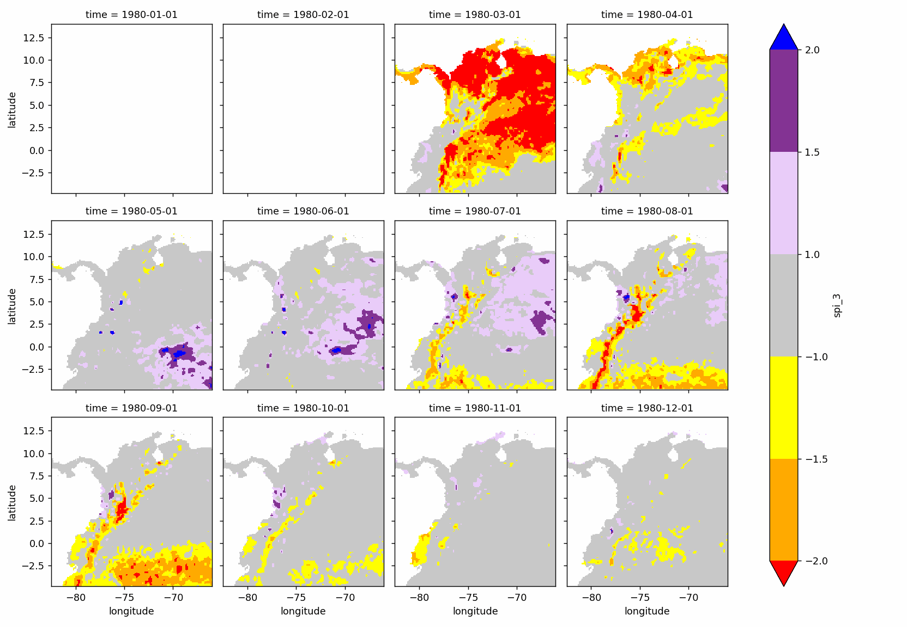

# Colombia - South America - Atmospheric water balance (AWB) and Drought analysis with the Standardized Precipitation Index (SPI)
Keywords: `SWB` `AWB` `SPI` `ERA5` `CRU`

The current research.....

## General parameters  

<div align="center">

| Parameter | Description |
|:---|:---|
| PPOI | 1 |
| Client | r.cfdtools Researching Area |
| Order | rcfdtools-000000001 |
| Date | 2023-05-30 |
| Dataset | ERA5Land_Monthly_01dd_ds1.nc |
| Units conversion multiplier | 1000.000000 |
| Precipitation maximum plot value | 20.000000 |
| Year from | 1980 |
| Year to | 1989 |

</div>

> The maximum plot value of precipitation is used to truncate the palette colors in the geographic map representations, pixels or cells over these values are displayed in a single color.

## Standardized Precipitation Index (SPI)

The Standardized Precipitation Index (SPI) is a widely used index to characterize meteorological drought on a range of timescales. On short timescales, the SPI is closely related to soil moisture, while at longer timescales, the SPI can be related to groundwater and reservoir storage. The SPI can be compared across regions with markedly different climates. It quantifies observed precipitation as a standardized departure from a selected probability distribution function that models the raw precipitation data. The raw precipitation data are typically fitted to a gamma or a Pearson Type III distribution, and then transformed to a normal distribution. The SPI values can be interpreted as the number of standard deviations by which the observed anomaly deviates from the long-term mean. The SPI can be created for differing periods of 1-to-36 months, using monthly input data. For the operational community, the SPI has been recognized as the standard index that should be available worldwide for quantifying and reporting meteorological drought. Concerns have been raised about the utility of the SPI as a measure of changes in drought associated with climate change, as it does not deal with changes in evapotranspiration. [(NCAR)](https://climatedataguide.ucar.edu/climate-data/standardized-precipitation-index-spi)

Precipitation: accumulated liquid and frozen water, including rain and snow, that falls to the Earths surface. It is the sum of large-scale precipitation (that precipitation which is generated by large-scale weather patterns, such as troughs and cold fronts) and convective precipitation (generated by convection which occurs when air at lower levels in the atmosphere is warmer and less dense than the air above, so it rises). Precipitation variables do not include fog, dew or the precipitation that evaporates in the atmosphere before it lands at the surface of the Earth. This variable is accumulated from the beginning of the forecast time to the end of the forecast step. The units of precipitation are depth in metres. It is the depth the water would have if it were spread evenly over the grid box. Care should be taken when comparing model variables with observations, because observations are often local to a particular point in space and time, rather than representing averages over a model grid box and model time step. [(www.copernicus.eu)](https://cds.climate.copernicus.eu/cdsapp#!/dataset/reanalysis-era5-land-monthly-means)

* SPI index mobile average times: [1, 3]

### Zonal analysis over N: 5.735000°, S: 3.625000°, E: -72.875000°, W: -74.875000°

#### NetCDF initial content

```
<xarray.Dataset>
Dimensions:    (longitude: 711, latitude: 741, time: 468)
Coordinates:
  * longitude  (longitude) float32 -96.0 -95.9 -95.8 -95.7 ... -25.2 -25.1 -25.0
  * latitude   (latitude) float32 16.0 15.9 15.8 15.7 ... -57.8 -57.9 -58.0
  * time       (time) datetime64[ns] 1980-01-01 1980-02-01 ... 2022-12-01
Data variables:
    u10        (time, latitude, longitude) float32 ...
    v10        (time, latitude, longitude) float32 ...
    t2m        (time, latitude, longitude) float32 ...
    e          (time, latitude, longitude) float32 ...
    tp         (time, latitude, longitude) float32 0.949 0.7166 ... nan nan
Attributes:
    Conventions:  CF-1.6
    history:      2023-05-15 19:06:50 GMT by grib_to_netcdf-2.24.0: /opt/ecmw...
```

#### Individual plots

[`P-1980`](spi/era5/era5_p_1980.png) [`SPI-1-1980`](spi/era5/era5_spi_1_1980.png) [`P-1981`](spi/era5/era5_p_1981.png) [`SPI-1-1981`](spi/era5/era5_spi_1_1981.png) [`P-1982`](spi/era5/era5_p_1982.png) [`SPI-1-1982`](spi/era5/era5_spi_1_1982.png) [`P-1983`](spi/era5/era5_p_1983.png) [`SPI-1-1983`](spi/era5/era5_spi_1_1983.png) [`P-1984`](spi/era5/era5_p_1984.png) [`SPI-1-1984`](spi/era5/era5_spi_1_1984.png) [`P-1985`](spi/era5/era5_p_1985.png) [`SPI-1-1985`](spi/era5/era5_spi_1_1985.png) [`P-1986`](spi/era5/era5_p_1986.png) [`SPI-1-1986`](spi/era5/era5_spi_1_1986.png) [`P-1987`](spi/era5/era5_p_1987.png) [`SPI-1-1987`](spi/era5/era5_spi_1_1987.png) [`P-1988`](spi/era5/era5_p_1988.png) [`SPI-1-1988`](spi/era5/era5_spi_1_1988.png) [`P-1989`](spi/era5/era5_p_1989.png) [`SPI-1-1989`](spi/era5/era5_spi_1_1989.png) [`SPI-3-1980`](spi/era5/era5_spi_3_1980.png) [`SPI-3-1981`](spi/era5/era5_spi_3_1981.png) [`SPI-3-1982`](spi/era5/era5_spi_3_1982.png) [`SPI-3-1983`](spi/era5/era5_spi_3_1983.png) [`SPI-3-1984`](spi/era5/era5_spi_3_1984.png) [`SPI-3-1985`](spi/era5/era5_spi_3_1985.png) [`SPI-3-1986`](spi/era5/era5_spi_3_1986.png) [`SPI-3-1987`](spi/era5/era5_spi_3_1987.png) [`SPI-3-1988`](spi/era5/era5_spi_3_1988.png) [`SPI-3-1989`](spi/era5/era5_spi_3_1989.png) 

#### Output datasets

* Dataset as comma-separated values: [era5_spi_polygon.csv](spi/)
* Dataset as NetCDF: [era5_spi_polygon.nc](spi/)

#### Animations

Precipitation

SPI-1


SPI-3



Records processed: 37920000