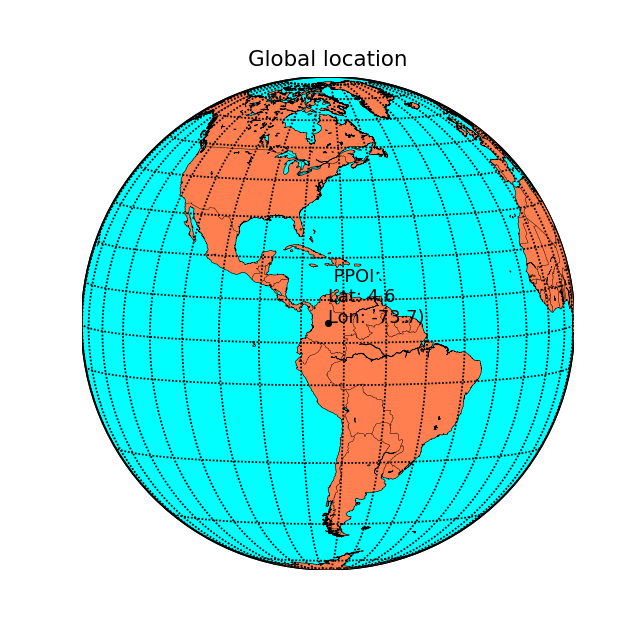

# Colombia - South America - Atmospheric water balance (AWB) and Drought analysis with the Standardized Precipitation Index (SPI)
Keywords: `SWB` `AWB` `SPI` `ERA5` `CRU`

The current research.....

## General parameters  

| Parameter | Description |
|:---|:---|
| PPOI | 1 |
| Client | r.cfdtools Researching Area |
| Order | rcfdtools-000000001 |
| Date | 2023-05-30 |
| Dataset | [ERA5Land_Monthly_01dd_ds1.nc](../../.netcdf/) |
| Units conversion multiplier | 1000.000000 |
| Precipitation maximum plot value | 20.000000 |
| Year from | 1980 |
| Year to | 1982 |

> The maximum plot value of precipitation is used to truncate the palette colors in the geographic map representations, pixels or cells over these values are displayed in a single color. 

</img></img>