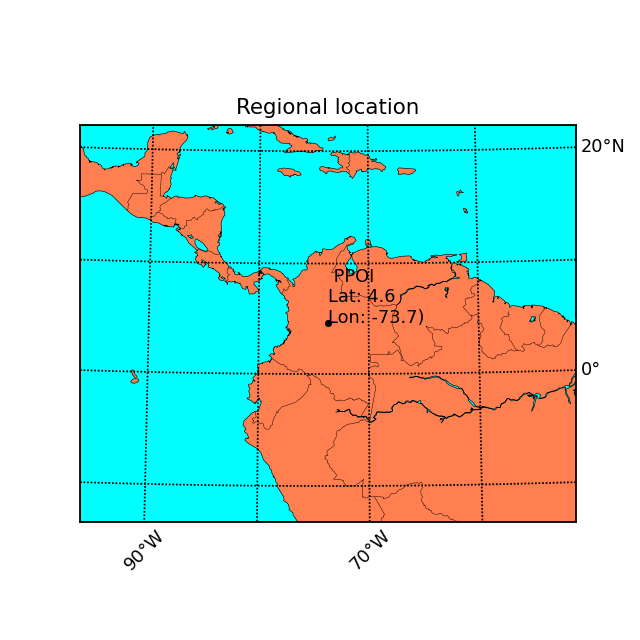
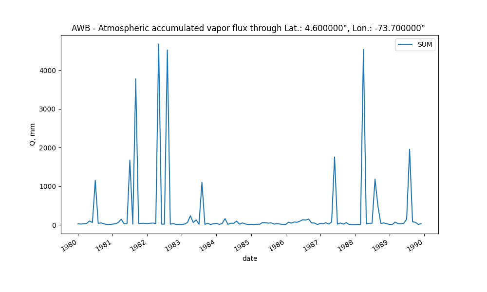

# Colombia - South America - Atmospheric water balance (AWB) and Drought analysis with the Standardized Precipitation Index (SPI)
Keywords: `SWB` `AWB` `SPI` `ERA5` `CRU`

The current research.....

## General parameters  

| Parameter | Description |
|:---|:---|
| PPOI | 1 |
| Client | r.cfdtools Researching Area |
| Order | rcfdtools-000000001 |
| Date | 2023-05-30 |
| Dataset | [ERA5Land_Monthly_01dd_ds1.nc](../../.netcdf/) |
| Units conversion multiplier | 1000.000000 |
| Precipitation maximum plot value | 20.000000 |
| Year from | 1980 |
| Year to | 1982 |

> The maximum plot value of precipitation is used to truncate the palette colors in the geographic map representations, pixels or cells over these values are displayed in a single color. 

</img></img>
## Atmospheric Water Balance (AWB) with ERA5 monthly through Latitude: 4.600000°, Longitude: -73.700000° or nearest

Processed years: [1980. 1981. 1982. 1983. 1984. 1985. 1986. 1987. 1988. 1989.]

### Initial processed dataset ([awb_q.csv](awb/))

|       |   1980-01-01 00:00:00 |   1980-01-01 00:00:00 |   1980-02-01 00:00:00 |   1980-02-01 00:00:00 |   1980-03-01 00:00:00 |   1980-03-01 00:00:00 |   1980-04-01 00:00:00 |   1980-04-01 00:00:00 |   1980-05-01 00:00:00 |   1980-05-01 00:00:00 |   1980-06-01 00:00:00 |   1980-06-01 00:00:00 |   1980-07-01 00:00:00 |   1980-07-01 00:00:00 |   1980-08-01 00:00:00 |   1980-08-01 00:00:00 |   1980-09-01 00:00:00 |   1980-09-01 00:00:00 |   1980-10-01 00:00:00 |   1980-11-01 00:00:00 |   1980-12-01 00:00:00 |   1981-01-01 00:00:00 |   1981-01-01 00:00:00 |   1981-02-01 00:00:00 |   1981-02-01 00:00:00 |   1981-03-01 00:00:00 |   1981-03-01 00:00:00 |   1981-04-01 00:00:00 |   1981-04-01 00:00:00 |   1981-05-01 00:00:00 |   1981-05-01 00:00:00 |   1981-06-01 00:00:00 |   1981-06-01 00:00:00 |   1981-07-01 00:00:00 |   1981-07-01 00:00:00 |   1981-08-01 00:00:00 |   1981-08-01 00:00:00 |   1981-09-01 00:00:00 |   1981-09-01 00:00:00 |   1981-10-01 00:00:00 |   1981-11-01 00:00:00 |   1981-12-01 00:00:00 |   1982-01-01 00:00:00 |   1982-01-01 00:00:00 |   1982-02-01 00:00:00 |   1982-02-01 00:00:00 |   1982-03-01 00:00:00 |   1982-03-01 00:00:00 |   1982-04-01 00:00:00 |   1982-04-01 00:00:00 |   1982-05-01 00:00:00 |   1982-05-01 00:00:00 |   1982-06-01 00:00:00 |   1982-06-01 00:00:00 |   1982-07-01 00:00:00 |   1982-07-01 00:00:00 |   1982-08-01 00:00:00 |   1982-08-01 00:00:00 |   1982-09-01 00:00:00 |   1982-09-01 00:00:00 |   1982-10-01 00:00:00 |   1982-11-01 00:00:00 |   1982-12-01 00:00:00 |   1983-01-01 00:00:00 |   1983-02-01 00:00:00 |   1983-03-01 00:00:00 |   1983-04-01 00:00:00 |   1983-05-01 00:00:00 |   1983-06-01 00:00:00 |   1983-07-01 00:00:00 |   1983-08-01 00:00:00 |   1983-09-01 00:00:00 |   1983-10-01 00:00:00 |   1983-11-01 00:00:00 |   1983-12-01 00:00:00 |   1984-01-01 00:00:00 |   1984-02-01 00:00:00 |   1984-03-01 00:00:00 |   1984-04-01 00:00:00 |   1984-05-01 00:00:00 |   1984-06-01 00:00:00 |   1984-07-01 00:00:00 |   1984-08-01 00:00:00 |   1984-09-01 00:00:00 |   1984-10-01 00:00:00 |   1984-11-01 00:00:00 |   1984-12-01 00:00:00 |   1985-01-01 00:00:00 |   1985-02-01 00:00:00 |   1985-03-01 00:00:00 |   1985-04-01 00:00:00 |   1985-05-01 00:00:00 |   1985-06-01 00:00:00 |   1985-07-01 00:00:00 |   1985-08-01 00:00:00 |   1985-09-01 00:00:00 |   1985-10-01 00:00:00 |   1985-11-01 00:00:00 |   1985-12-01 00:00:00 |   1986-01-01 00:00:00 |   1986-02-01 00:00:00 |   1986-03-01 00:00:00 |   1986-04-01 00:00:00 |   1986-05-01 00:00:00 |   1986-06-01 00:00:00 |   1986-07-01 00:00:00 |   1986-08-01 00:00:00 |   1986-09-01 00:00:00 |   1986-10-01 00:00:00 |   1986-11-01 00:00:00 |   1986-12-01 00:00:00 |   1987-01-01 00:00:00 |   1987-02-01 00:00:00 |   1987-03-01 00:00:00 |   1987-04-01 00:00:00 |   1987-05-01 00:00:00 |   1987-06-01 00:00:00 |   1987-07-01 00:00:00 |   1987-08-01 00:00:00 |   1987-09-01 00:00:00 |   1987-10-01 00:00:00 |   1987-11-01 00:00:00 |   1987-12-01 00:00:00 |   1988-01-01 00:00:00 |   1988-02-01 00:00:00 |   1988-03-01 00:00:00 |   1988-04-01 00:00:00 |   1988-05-01 00:00:00 |   1988-06-01 00:00:00 |   1988-07-01 00:00:00 |   1988-08-01 00:00:00 |   1988-09-01 00:00:00 |   1988-10-01 00:00:00 |   1988-11-01 00:00:00 |   1988-12-01 00:00:00 |   1989-01-01 00:00:00 |   1989-02-01 00:00:00 |   1989-03-01 00:00:00 |   1989-04-01 00:00:00 |   1989-05-01 00:00:00 |   1989-06-01 00:00:00 |   1989-07-01 00:00:00 |   1989-08-01 00:00:00 |   1989-09-01 00:00:00 |   1989-10-01 00:00:00 |   1989-11-01 00:00:00 |   1989-12-01 00:00:00 |
|:------|----------------------:|----------------------:|----------------------:|----------------------:|----------------------:|----------------------:|----------------------:|----------------------:|----------------------:|----------------------:|----------------------:|----------------------:|----------------------:|----------------------:|----------------------:|----------------------:|----------------------:|----------------------:|----------------------:|----------------------:|----------------------:|----------------------:|----------------------:|----------------------:|----------------------:|----------------------:|----------------------:|----------------------:|----------------------:|----------------------:|----------------------:|----------------------:|----------------------:|----------------------:|----------------------:|----------------------:|----------------------:|----------------------:|----------------------:|----------------------:|----------------------:|----------------------:|----------------------:|----------------------:|----------------------:|----------------------:|----------------------:|----------------------:|----------------------:|----------------------:|----------------------:|----------------------:|----------------------:|----------------------:|----------------------:|----------------------:|----------------------:|----------------------:|----------------------:|----------------------:|----------------------:|----------------------:|----------------------:|----------------------:|----------------------:|----------------------:|----------------------:|----------------------:|----------------------:|----------------------:|----------------------:|----------------------:|----------------------:|----------------------:|----------------------:|----------------------:|----------------------:|----------------------:|----------------------:|----------------------:|----------------------:|----------------------:|----------------------:|----------------------:|----------------------:|----------------------:|----------------------:|----------------------:|----------------------:|----------------------:|----------------------:|----------------------:|----------------------:|----------------------:|----------------------:|----------------------:|----------------------:|----------------------:|----------------------:|----------------------:|----------------------:|----------------------:|----------------------:|----------------------:|----------------------:|----------------------:|----------------------:|----------------------:|----------------------:|----------------------:|----------------------:|----------------------:|----------------------:|----------------------:|----------------------:|----------------------:|----------------------:|----------------------:|----------------------:|----------------------:|----------------------:|----------------------:|----------------------:|----------------------:|----------------------:|----------------------:|----------------------:|----------------------:|----------------------:|----------------------:|----------------------:|----------------------:|----------------------:|----------------------:|----------------------:|----------------------:|----------------------:|----------------------:|----------------------:|----------------------:|----------------------:|----------------------:|----------------------:|----------------------:|----------------------:|----------------------:|----------------------:|
| Value |             1         |             1         |             1         |             1         |             1         |             1         |             1         |             1         |             1         |             1         |             1         |             1         |               1       |               1       |             1         |             1         |             1         |             1         |             1         |            1          |            1          |             1         |             1         |             1         |             1         |             1         |             1         |             1         |             1         |             1         |             1         |             1         |             1         |               1       |               1       |             1         |             1         |                1      |                1      |             1         |             1         |             1         |             1         |             1         |             1         |             1         |             1         |             1         |             1         |             1         |               1       |               1       |             1         |             1         |             1         |             1         |               1       |               1       |             1         |             1         |             1         |            1          |            1          |            1          |             1         |             1         |              1        |             1         |              1        |             1         |               1       |             1         |             1         |            1          |             1         |             1         |            1          |             1         |              1        |            1          |             1         |             1         |             1         |             1         |             1         |             1         |            1          |            1          |            1          |            1          |            1          |             1         |             1         |             1         |             1         |             1         |             1         |             1         |            1          |            1          |             1         |             1         |             1         |             1         |             1         |              1        |              1        |              1        |             1         |             1         |            1          |             1         |             1         |             1         |             1         |             1         |               1       |             1         |             1         |             1         |             1         |            1          |            1          |            1          |            1          |            1          |                1      |             1         |             1         |             1         |              1        |              1        |             1         |             1         |             1         |            1          |            1          |             1         |             1         |             1         |             1         |              1        |               1       |             1         |             1         |            1          |             1         |
| COUNT |             4         |             4         |             3         |             3         |             3         |             3         |             3         |             3         |             8         |             8         |             6         |             6         |             107       |             107       |             5         |             5         |             6         |             6         |             3         |            1          |            1          |             3         |             3         |             3         |             3         |             8         |             8         |            10         |            10         |             2         |             2         |             2         |             2         |             166       |             166       |             2         |             2         |              335      |              335      |             4         |             4         |             5         |             3         |             3         |             3         |             3         |             3         |             3         |             2         |             2         |             465       |             465       |             2         |             2         |             2         |             2         |             438       |             438       |             2         |             2         |             4         |            1          |            1          |            1          |             3         |             8         |             15        |             7         |             12        |             2         |              99       |             2         |             4         |            1          |             3         |             3         |            1          |             3         |             13        |            1          |             5         |             6         |            10         |             2         |             6         |             2         |            1          |            1          |            1          |            1          |            1          |             5         |             5         |             6         |             7         |             2         |             3         |             2         |            1          |            1          |             5         |             3         |             6         |             6         |             8         |             15        |             20        |             13        |             4         |             4         |            1          |             5         |             3         |             5         |             2         |             6         |             166       |             2         |             6         |             2         |             5         |            1          |            1          |            1          |            1          |            1          |              326      |             2         |             4         |             4         |             96        |             44        |             3         |             4         |             3         |            1          |            1          |             4         |             3         |             2         |             5         |             16        |             173       |             8         |             8         |            1          |             4         |
| AREA  |             0.0399988 |             0.0399988 |             0.0299991 |             0.0299991 |             0.0299991 |             0.0299991 |             0.0299991 |             0.0299991 |             0.0799976 |             0.0799976 |             0.0599982 |             0.0599982 |               1.06997 |               1.06997 |             0.0499985 |             0.0499985 |             0.0599982 |             0.0599982 |             0.0299991 |            0.00999969 |            0.00999969 |             0.0299991 |             0.0299991 |             0.0299991 |             0.0299991 |             0.0799976 |             0.0799976 |             0.0999969 |             0.0999969 |             0.0199994 |             0.0199994 |             0.0199994 |             0.0199994 |               1.65995 |               1.65995 |             0.0199994 |             0.0199994 |                3.3499 |                3.3499 |             0.0399988 |             0.0399988 |             0.0499985 |             0.0299991 |             0.0299991 |             0.0299991 |             0.0299991 |             0.0299991 |             0.0299991 |             0.0199994 |             0.0199994 |               4.64986 |               4.64986 |             0.0199994 |             0.0199994 |             0.0199994 |             0.0199994 |               4.37987 |               4.37987 |             0.0199994 |             0.0199994 |             0.0399988 |            0.00999969 |            0.00999969 |            0.00999969 |             0.0299991 |             0.0799976 |              0.149995 |             0.0699979 |              0.119996 |             0.0199994 |               0.98997 |             0.0199994 |             0.0399988 |            0.00999969 |             0.0299991 |             0.0299991 |            0.00999969 |             0.0299991 |              0.129996 |            0.00999969 |             0.0499985 |             0.0599982 |             0.0999969 |             0.0199994 |             0.0599982 |             0.0199994 |            0.00999969 |            0.00999969 |            0.00999969 |            0.00999969 |            0.00999969 |             0.0499985 |             0.0499985 |             0.0599982 |             0.0699979 |             0.0199994 |             0.0299991 |             0.0199994 |            0.00999969 |            0.00999969 |             0.0499985 |             0.0299991 |             0.0599982 |             0.0599982 |             0.0799976 |              0.149995 |              0.199994 |              0.129996 |             0.0399988 |             0.0399988 |            0.00999969 |             0.0499985 |             0.0299991 |             0.0499985 |             0.0199994 |             0.0599982 |               1.65995 |             0.0199994 |             0.0599982 |             0.0199994 |             0.0499985 |            0.00999969 |            0.00999969 |            0.00999969 |            0.00999969 |            0.00999969 |                3.2599 |             0.0199994 |             0.0399988 |             0.0399988 |              0.959971 |              0.439987 |             0.0299991 |             0.0399988 |             0.0299991 |            0.00999969 |            0.00999969 |             0.0399988 |             0.0299991 |             0.0199994 |             0.0499985 |              0.159995 |               1.72995 |             0.0799976 |             0.0799976 |            0.00999969 |             0.0399988 |
| SUM   |            29.3501    |            29.3501    |            20.4801    |            20.4801    |            30.7606    |            30.7606    |            37.8694    |            37.8694    |           100.388     |           100.388     |            60.5792    |            60.5792    |            1150.09    |            1150.09    |            39.8448    |            39.8448    |            50.5525    |            50.5525    |            28.7131    |           10.2865     |            9.90212    |            19.2671    |            19.2671    |            32.3198    |            32.3198    |            61.5103    |            61.5103    |           147.022     |           147.022     |            31.0522    |            31.0522    |            30.7996    |            30.7996    |            1678.37    |            1678.37    |            20.2685    |            20.2685    |             3777.79   |             3777.79   |            34.3986    |            41.1708    |            40.8905    |            32.5983    |            32.5983    |            42.1435    |            42.1435    |            47.2293    |            47.2293    |            36.3205    |            36.3205    |            4677.49    |            4677.49    |            19.8668    |            19.8668    |            19.4714    |            19.4714    |            4523.45    |            4523.45    |            16.7323    |            16.7323    |            35.1406    |           12.3548     |            9.72259    |            8.47757    |            23.6888    |            61.0746    |            235.463    |            61.293     |            129.624    |            17.2027    |            1099.71    |            13.9468    |            40.8155    |            9.59724    |            29.5744    |            40.2923    |           13.1274     |            33.6891    |            162.247    |           12.2983     |            44.0653    |            40.9965    |            97.2596    |            18.3523    |            52.5115    |            23.2428    |            9.26134    |           11.8496     |            8.76813    |           16.1924     |           15.1791     |            60.616     |            55.8091    |            45.4304    |            53.6531    |            19.0992    |            35.5203    |            21.8787    |           10.3249     |           10.2651     |            69.7846    |            45.2434    |            74.6131    |            66.5979    |            98.1005    |            133.374    |            125.115    |            150.804    |            50.7614    |            47.9743    |            8.81241    |            37.6558    |            29.1474    |            56.3238    |            21.2753    |            73.7137    |            1756.52    |            19.6785    |            49.5047    |            19.1961    |            57.0321    |           13.0802     |            8.04356    |            7.95125    |           12.4093     |           12.4345     |             4540.74   |            27.454     |            41.762     |            42.5516    |           1182.22     |            482.009    |            38.1176    |            49.8767    |            31.9951    |           11.0475     |           11.7726     |            72.264     |            31.9748    |            30.8185    |            41.4064    |            149.188    |            1953.94    |            82.1326    |            66.306     |           12.4783     |            30.9825    |
| day   |             1         |             1         |             1         |             1         |             1         |             1         |             1         |             1         |             1         |             1         |             1         |             1         |               1       |               1       |             1         |             1         |             1         |             1         |             1         |            1          |            1          |             1         |             1         |             1         |             1         |             1         |             1         |             1         |             1         |             1         |             1         |             1         |             1         |               1       |               1       |             1         |             1         |                1      |                1      |             1         |             1         |             1         |             1         |             1         |             1         |             1         |             1         |             1         |             1         |             1         |               1       |               1       |             1         |             1         |             1         |             1         |               1       |               1       |             1         |             1         |             1         |            1          |            1          |            1          |             1         |             1         |              1        |             1         |              1        |             1         |               1       |             1         |             1         |            1          |             1         |             1         |            1          |             1         |              1        |            1          |             1         |             1         |             1         |             1         |             1         |             1         |            1          |            1          |            1          |            1          |            1          |             1         |             1         |             1         |             1         |             1         |             1         |             1         |            1          |            1          |             1         |             1         |             1         |             1         |             1         |              1        |              1        |              1        |             1         |             1         |            1          |             1         |             1         |             1         |             1         |             1         |               1       |             1         |             1         |             1         |             1         |            1          |            1          |            1          |            1          |            1          |                1      |             1         |             1         |             1         |              1        |              1        |             1         |             1         |             1         |            1          |            1          |             1         |             1         |             1         |             1         |              1        |               1       |             1         |             1         |            1          |             1         |
| month |             1         |             1         |             2         |             2         |             3         |             3         |             4         |             4         |             5         |             5         |             6         |             6         |               7       |               7       |             8         |             8         |             9         |             9         |            10         |           11          |           12          |             1         |             1         |             2         |             2         |             3         |             3         |             4         |             4         |             5         |             5         |             6         |             6         |               7       |               7       |             8         |             8         |                9      |                9      |            10         |            11         |            12         |             1         |             1         |             2         |             2         |             3         |             3         |             4         |             4         |               5       |               5       |             6         |             6         |             7         |             7         |               8       |               8       |             9         |             9         |            10         |           11          |           12          |            1          |             2         |             3         |              4        |             5         |              6        |             7         |               8       |             9         |            10         |           11          |            12         |             1         |            2          |             3         |              4        |            5          |             6         |             7         |             8         |             9         |            10         |            11         |           12          |            1          |            2          |            3          |            4          |             5         |             6         |             7         |             8         |             9         |            10         |            11         |           12          |            1          |             2         |             3         |             4         |             5         |             6         |              7        |              8        |              9        |            10         |            11         |           12          |             1         |             2         |             3         |             4         |             5         |               6       |             7         |             8         |             9         |            10         |           11          |           12          |            1          |            2          |            3          |                4      |             5         |             6         |             7         |              8        |              9        |            10         |            11         |            12         |            1          |            2          |             3         |             4         |             5         |             6         |              7        |               8       |             9         |            10         |           11          |            12         |
| year  |          1980         |          1980         |          1980         |          1980         |          1980         |          1980         |          1980         |          1980         |          1980         |          1980         |          1980         |          1980         |            1980       |            1980       |          1980         |          1980         |          1980         |          1980         |          1980         |         1980          |         1980          |          1981         |          1981         |          1981         |          1981         |          1981         |          1981         |          1981         |          1981         |          1981         |          1981         |          1981         |          1981         |            1981       |            1981       |          1981         |          1981         |             1981      |             1981      |          1981         |          1981         |          1981         |          1982         |          1982         |          1982         |          1982         |          1982         |          1982         |          1982         |          1982         |            1982       |            1982       |          1982         |          1982         |          1982         |          1982         |            1982       |            1982       |          1982         |          1982         |          1982         |         1982          |         1982          |         1983          |          1983         |          1983         |           1983        |          1983         |           1983        |          1983         |            1983       |          1983         |          1983         |         1983          |          1983         |          1984         |         1984          |          1984         |           1984        |         1984          |          1984         |          1984         |          1984         |          1984         |          1984         |          1984         |         1984          |         1985          |         1985          |         1985          |         1985          |          1985         |          1985         |          1985         |          1985         |          1985         |          1985         |          1985         |         1985          |         1986          |          1986         |          1986         |          1986         |          1986         |          1986         |           1986        |           1986        |           1986        |          1986         |          1986         |         1986          |          1987         |          1987         |          1987         |          1987         |          1987         |            1987       |          1987         |          1987         |          1987         |          1987         |         1987          |         1987          |         1988          |         1988          |         1988          |             1988      |          1988         |          1988         |          1988         |           1988        |           1988        |          1988         |          1988         |          1988         |         1989          |         1989          |          1989         |          1989         |          1989         |          1989         |           1989        |            1989       |          1989         |          1989         |         1989          |          1989         |
| Akm2  |           588.643     |           588.643     |           441.482     |           441.482     |           441.482     |           441.482     |           441.482     |           441.482     |          1177.29      |          1177.29      |           882.964     |           882.964     |           15746.2     |           15746.2     |           735.803     |           735.803     |           882.964     |           882.964     |           441.482     |          147.161      |          147.161      |           441.482     |           441.482     |           441.482     |           441.482     |          1177.29      |          1177.29      |          1471.61      |          1471.61      |           294.321     |           294.321     |           294.321     |           294.321     |           24428.7     |           24428.7     |           294.321     |           294.321     |            49298.8    |            49298.8    |           588.643     |           588.643     |           735.803     |           441.482     |           441.482     |           441.482     |           441.482     |           441.482     |           441.482     |           294.321     |           294.321     |           68429.7     |           68429.7     |           294.321     |           294.321     |           294.321     |           294.321     |           64456.4     |           64456.4     |           294.321     |           294.321     |           588.643     |          147.161      |          147.161      |          147.161      |           441.482     |          1177.29      |           2207.41     |          1030.12      |           1765.93     |           294.321     |           14568.9     |           294.321     |           588.643     |          147.161      |           441.482     |           441.482     |          147.161      |           441.482     |           1913.09     |          147.161      |           735.803     |           882.964     |          1471.61      |           294.321     |           882.964     |           294.321     |          147.161      |          147.161      |          147.161      |          147.161      |          147.161      |           735.803     |           735.803     |           882.964     |          1030.12      |           294.321     |           441.482     |           294.321     |          147.161      |          147.161      |           735.803     |           441.482     |           882.964     |           882.964     |          1177.29      |           2207.41     |           2943.21     |           1913.09     |           588.643     |           588.643     |          147.161      |           735.803     |           441.482     |           735.803     |           294.321     |           882.964     |           24428.7     |           294.321     |           882.964     |           294.321     |           735.803     |          147.161      |          147.161      |          147.161      |          147.161      |          147.161      |            47974.4    |           294.321     |           588.643     |           588.643     |          14127.4      |           6475.07     |           441.482     |           588.643     |           441.482     |          147.161      |          147.161      |           588.643     |           441.482     |           294.321     |           735.803     |           2354.57     |           25458.8     |          1177.29      |          1177.29      |          147.161      |           588.643     |

> Dataset vars description: `Value` 1 represents atmospheric wind direction cells over the study point, `COUNT` converged atmospheric pixels to the study point,  `AREA` spatial aportation area in decimal degrees `SUM` vapor flux sum, `day` day of study, `month` month of study, `year` year of study, `Akm2` spatial aportation area in square kilometers

### Atmospheric vapor flux - Pivot table ([awb_q_pivot.csv](awb/))

|   month |       1980 |      1981 |       1982 |       1983 |      1984 |     1985 |      1986 |       1987 |       1988 |      1989 |
|--------:|-----------:|----------:|-----------:|-----------:|----------:|---------:|----------:|-----------:|-----------:|----------:|
|       1 |   29.3501  |   19.2671 |   32.5983  |    8.47757 |  40.2923  | 11.8496  |  10.2651  |   37.6558  |    7.95125 |   11.0475 |
|       2 |   20.4801  |   32.3198 |   42.1435  |   23.6888  |  13.1274  |  8.76813 |  69.7846  |   29.1474  |   12.4093  |   11.7726 |
|       3 |   30.7606  |   61.5103 |   47.2293  |   61.0746  |  33.6891  | 16.1924  |  45.2434  |   56.3238  |   12.4345  |   72.264  |
|       4 |   37.8694  |  147.022  |   36.3205  |  235.463   | 162.247   | 15.1791  |  74.6131  |   21.2753  | 4540.74    |   31.9748 |
|       5 |  100.388   |   31.0522 | 4677.49    |   61.293   |  12.2983  | 60.616   |  66.5979  |   73.7137  |   27.454   |   30.8185 |
|       6 |   60.5792  |   30.7996 |   19.8668  |  129.624   |  44.0653  | 55.8091  |  98.1005  | 1756.52    |   41.762   |   41.4064 |
|       7 | 1150.09    | 1678.37   |   19.4714  |   17.2027  |  40.9965  | 45.4304  | 133.374   |   19.6785  |   42.5516  |  149.188  |
|       8 |   39.8448  |   20.2685 | 4523.45    | 1099.71    |  97.2596  | 53.6531  | 125.115   |   49.5047  | 1182.22    | 1953.94   |
|       9 |   50.5525  | 3777.79   |   16.7323  |   13.9468  |  18.3523  | 19.0992  | 150.804   |   19.1961  |  482.009   |   82.1326 |
|      10 |   28.7131  |   34.3986 |   35.1406  |   40.8155  |  52.5115  | 35.5203  |  50.7614  |   57.0321  |   38.1176  |   66.306  |
|      11 |   10.2865  |   41.1708 |   12.3548  |    9.59724 |  23.2428  | 21.8787  |  47.9743  |   13.0802  |   49.8767  |   12.4783 |
|      12 |    9.90212 |   40.8905 |    9.72259 |   29.5744  |   9.26134 | 10.3249  |   8.81241 |    8.04356 |   31.9951  |   30.9825 |

### Atmospheric accumulation area (A) - Pivot table ([awb_a_pivot.csv](awb/))

|   month |      1980 |      1981 |      1982 |      1983 |     1984 |     1985 |     1986 |      1987 |      1988 |      1989 |
|--------:|----------:|----------:|----------:|----------:|---------:|---------:|---------:|----------:|----------:|----------:|
|       1 |   588.643 |   441.482 |   441.482 |   147.161 |  441.482 |  147.161 |  147.161 |   735.803 |   147.161 |   147.161 |
|       2 |   441.482 |   441.482 |   441.482 |   441.482 |  147.161 |  147.161 |  735.803 |   441.482 |   147.161 |   147.161 |
|       3 |   441.482 |  1177.29  |   441.482 |  1177.29  |  441.482 |  147.161 |  441.482 |   735.803 |   147.161 |   588.643 |
|       4 |   441.482 |  1471.61  |   294.321 |  2207.41  | 1913.09  |  147.161 |  882.964 |   294.321 | 47974.4   |   441.482 |
|       5 |  1177.29  |   294.321 | 68429.7   |  1030.12  |  147.161 |  735.803 |  882.964 |   882.964 |   294.321 |   294.321 |
|       6 |   882.964 |   294.321 |   294.321 |  1765.93  |  735.803 |  735.803 | 1177.29  | 24428.7   |   588.643 |   735.803 |
|       7 | 15746.2   | 24428.7   |   294.321 |   294.321 |  882.964 |  882.964 | 2207.41  |   294.321 |   588.643 |  2354.57  |
|       8 |   735.803 |   294.321 | 64456.4   | 14568.9   | 1471.61  | 1030.12  | 2943.21  |   882.964 | 14127.4   | 25458.8   |
|       9 |   882.964 | 49298.8   |   294.321 |   294.321 |  294.321 |  294.321 | 1913.09  |   294.321 |  6475.07  |  1177.29  |
|      10 |   441.482 |   588.643 |   588.643 |   588.643 |  882.964 |  441.482 |  588.643 |   735.803 |   441.482 |  1177.29  |
|      11 |   147.161 |   588.643 |   147.161 |   147.161 |  294.321 |  294.321 |  588.643 |   147.161 |   588.643 |   147.161 |
|      12 |   147.161 |   735.803 |   147.161 |   441.482 |  147.161 |  147.161 |  147.161 |   147.161 |   441.482 |   588.643 |

AWB records processed: 147

### Atmospheric basins and watersheds

</img></img>

Merged shafefiles: [`basindissolve.shp`](awb/shpout/basindissolve/merge) [`watershed.shp`](awb/shpout/watershed/merge) 

