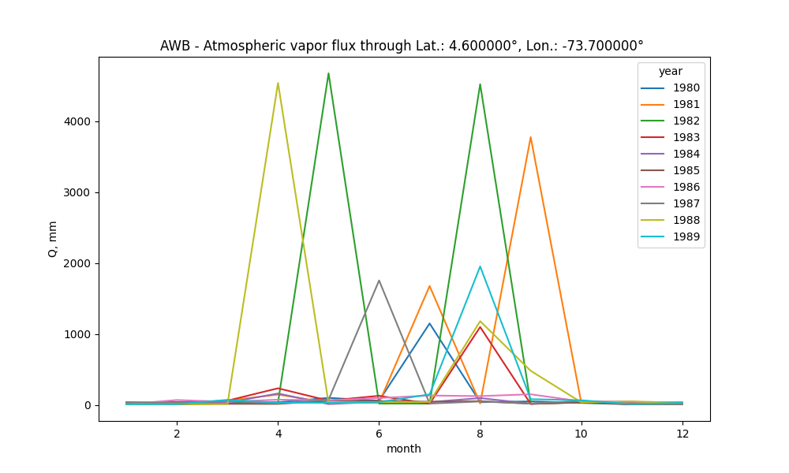
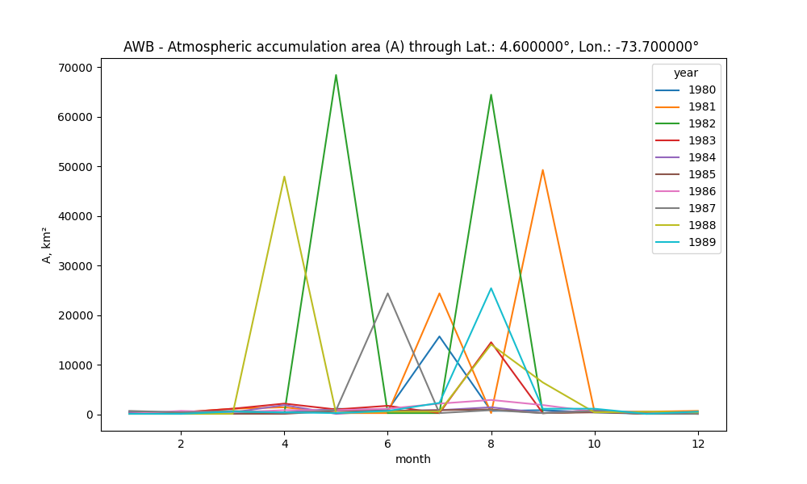

# Colombia - South America - Atmospheric water balance (AWB) and Drought analysis with the Standardized Precipitation Index (SPI)
Keywords: `SWB` `AWB` `SPI` `ERA5` `CRU`

The current research.....

## General parameters  

| Parameter | Description |
|:---|:---|
| PPOI | 1 |
| Client | r.cfdtools Researching Area |
| Order | rcfdtools-000000001 |
| Date | 2023-05-30 |
| Dataset | [ERA5Land_Monthly_01dd_ds1.nc](../../.netcdf/) |
| Units conversion multiplier | 1000.000000 |
| Precipitation maximum plot value | 20.000000 |
| Year from | 1980 |
| Year to | 1982 |

> The maximum plot value of precipitation is used to truncate the palette colors in the geographic map representations, pixels or cells over these values are displayed in a single color. 

</img></img>
## Atmospheric Water Balance (AWB) with ERA5 monthly through Latitude: 4.600000°, Longitude: -73.700000° or nearest

Processed years: [1980. 1981. 1982.]

### Initial processed dataset ([awb_q.csv](awb/))

|       |   1980-01-01 00:00:00 |   1980-02-01 00:00:00 |   1980-03-01 00:00:00 |   1980-04-01 00:00:00 |   1980-05-01 00:00:00 |   1980-06-01 00:00:00 |   1980-07-01 00:00:00 |   1980-08-01 00:00:00 |   1980-09-01 00:00:00 |   1980-10-01 00:00:00 |   1980-11-01 00:00:00 |   1980-12-01 00:00:00 |   1981-01-01 00:00:00 |   1981-02-01 00:00:00 |   1981-03-01 00:00:00 |   1981-04-01 00:00:00 |   1981-05-01 00:00:00 |   1981-06-01 00:00:00 |   1981-07-01 00:00:00 |   1981-08-01 00:00:00 |   1981-09-01 00:00:00 |   1981-10-01 00:00:00 |   1981-11-01 00:00:00 |   1981-12-01 00:00:00 |   1982-01-01 00:00:00 |   1982-02-01 00:00:00 |   1982-03-01 00:00:00 |   1982-04-01 00:00:00 |   1982-05-01 00:00:00 |   1982-06-01 00:00:00 |   1982-07-01 00:00:00 |   1982-08-01 00:00:00 |   1982-09-01 00:00:00 |   1982-10-01 00:00:00 |   1982-11-01 00:00:00 |   1982-12-01 00:00:00 |
|:------|----------------------:|----------------------:|----------------------:|----------------------:|----------------------:|----------------------:|----------------------:|----------------------:|----------------------:|----------------------:|----------------------:|----------------------:|----------------------:|----------------------:|----------------------:|----------------------:|----------------------:|----------------------:|----------------------:|----------------------:|----------------------:|----------------------:|----------------------:|----------------------:|----------------------:|----------------------:|----------------------:|----------------------:|----------------------:|----------------------:|----------------------:|----------------------:|----------------------:|----------------------:|----------------------:|----------------------:|
| Value |             1         |             1         |             1         |             1         |             1         |             1         |               1       |             1         |             1         |             1         |            1          |            1          |             1         |             1         |             1         |             1         |             1         |             1         |               1       |             1         |                1      |             1         |             1         |             1         |             1         |             1         |             1         |             1         |               1       |             1         |             1         |               1       |             1         |             1         |            1          |            1          |
| COUNT |             4         |             3         |             3         |             3         |             8         |             6         |             107       |             5         |             6         |             3         |            1          |            1          |             3         |             3         |             8         |            10         |             2         |             2         |             166       |             2         |              335      |             4         |             4         |             5         |             3         |             3         |             3         |             2         |             465       |             2         |             2         |             438       |             2         |             4         |            1          |            1          |
| AREA  |             0.0399988 |             0.0299991 |             0.0299991 |             0.0299991 |             0.0799976 |             0.0599982 |               1.06997 |             0.0499985 |             0.0599982 |             0.0299991 |            0.00999969 |            0.00999969 |             0.0299991 |             0.0299991 |             0.0799976 |             0.0999969 |             0.0199994 |             0.0199994 |               1.65995 |             0.0199994 |                3.3499 |             0.0399988 |             0.0399988 |             0.0499985 |             0.0299991 |             0.0299991 |             0.0299991 |             0.0199994 |               4.64986 |             0.0199994 |             0.0199994 |               4.37987 |             0.0199994 |             0.0399988 |            0.00999969 |            0.00999969 |
| SUM   |            29.3501    |            20.4801    |            30.7606    |            37.8694    |           100.388     |            60.5792    |            1150.09    |            39.8448    |            50.5525    |            28.7131    |           10.2865     |            9.90212    |            19.2671    |            32.3198    |            61.5103    |           147.022     |            31.0522    |            30.7996    |            1678.37    |            20.2685    |             3777.79   |            34.3986    |            41.1708    |            40.8905    |            32.5983    |            42.1435    |            47.2293    |            36.3205    |            4677.49    |            19.8668    |            19.4714    |            4523.45    |            16.7323    |            35.1406    |           12.3548     |            9.72259    |
| day   |             1         |             1         |             1         |             1         |             1         |             1         |               1       |             1         |             1         |             1         |            1          |            1          |             1         |             1         |             1         |             1         |             1         |             1         |               1       |             1         |                1      |             1         |             1         |             1         |             1         |             1         |             1         |             1         |               1       |             1         |             1         |               1       |             1         |             1         |            1          |            1          |
| month |             1         |             2         |             3         |             4         |             5         |             6         |               7       |             8         |             9         |            10         |           11          |           12          |             1         |             2         |             3         |             4         |             5         |             6         |               7       |             8         |                9      |            10         |            11         |            12         |             1         |             2         |             3         |             4         |               5       |             6         |             7         |               8       |             9         |            10         |           11          |           12          |
| year  |          1980         |          1980         |          1980         |          1980         |          1980         |          1980         |            1980       |          1980         |          1980         |          1980         |         1980          |         1980          |          1981         |          1981         |          1981         |          1981         |          1981         |          1981         |            1981       |          1981         |             1981      |          1981         |          1981         |          1981         |          1982         |          1982         |          1982         |          1982         |            1982       |          1982         |          1982         |            1982       |          1982         |          1982         |         1982          |         1982          |
| Akm2  |           588.643     |           441.482     |           441.482     |           441.482     |          1177.29      |           882.964     |           15746.2     |           735.803     |           882.964     |           441.482     |          147.161      |          147.161      |           441.482     |           441.482     |          1177.29      |          1471.61      |           294.321     |           294.321     |           24428.7     |           294.321     |            49298.8    |           588.643     |           588.643     |           735.803     |           441.482     |           441.482     |           441.482     |           294.321     |           68429.7     |           294.321     |           294.321     |           64456.4     |           294.321     |           588.643     |          147.161      |          147.161      |

> Dataset vars description: `Value` 1 represents atmospheric wind direction cells over the study point, `COUNT` converged atmospheric pixels to the study point,  `AREA` spatial aportation area in decimal degrees `SUM` vapor flux sum, `day` day of study, `month` month of study, `year` year of study, `Akm2` spatial aportation area in square kilometers

### Atmospheric vapor flux - Pivot table ([awb_q_pivot.csv](awb/))

|   month |       1980 |      1981 |       1982 |
|--------:|-----------:|----------:|-----------:|
|       1 |   29.3501  |   19.2671 |   32.5983  |
|       2 |   20.4801  |   32.3198 |   42.1435  |
|       3 |   30.7606  |   61.5103 |   47.2293  |
|       4 |   37.8694  |  147.022  |   36.3205  |
|       5 |  100.388   |   31.0522 | 4677.49    |
|       6 |   60.5792  |   30.7996 |   19.8668  |
|       7 | 1150.09    | 1678.37   |   19.4714  |
|       8 |   39.8448  |   20.2685 | 4523.45    |
|       9 |   50.5525  | 3777.79   |   16.7323  |
|      10 |   28.7131  |   34.3986 |   35.1406  |
|      11 |   10.2865  |   41.1708 |   12.3548  |
|      12 |    9.90212 |   40.8905 |    9.72259 |

### Atmospheric accumulation area (A) - Pivot table ([awb_a_pivot.csv](awb/))

|   month |      1980 |      1981 |      1982 |
|--------:|----------:|----------:|----------:|
|       1 |   588.643 |   441.482 |   441.482 |
|       2 |   441.482 |   441.482 |   441.482 |
|       3 |   441.482 |  1177.29  |   441.482 |
|       4 |   441.482 |  1471.61  |   294.321 |
|       5 |  1177.29  |   294.321 | 68429.7   |
|       6 |   882.964 |   294.321 |   294.321 |
|       7 | 15746.2   | 24428.7   |   294.321 |
|       8 |   735.803 |   294.321 | 64456.4   |
|       9 |   882.964 | 49298.8   |   294.321 |
|      10 |   441.482 |   588.643 |   588.643 |
|      11 |   147.161 |   588.643 |   147.161 |
|      12 |   147.161 |   735.803 |   147.161 |

AWB records processed: 36

### Atmospheric basins and watersheds

